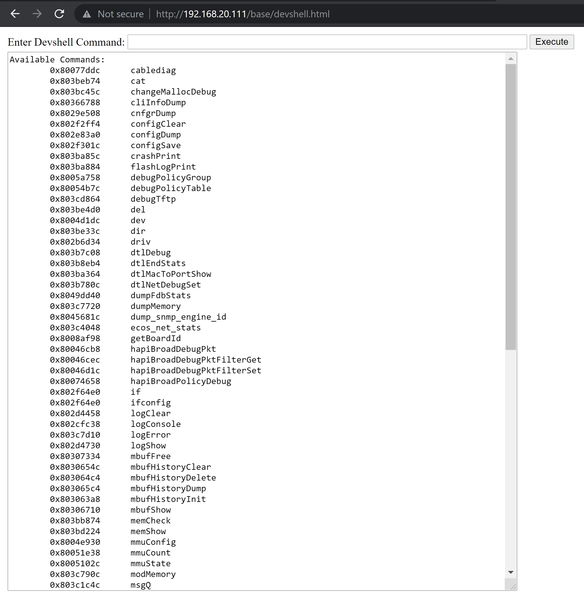
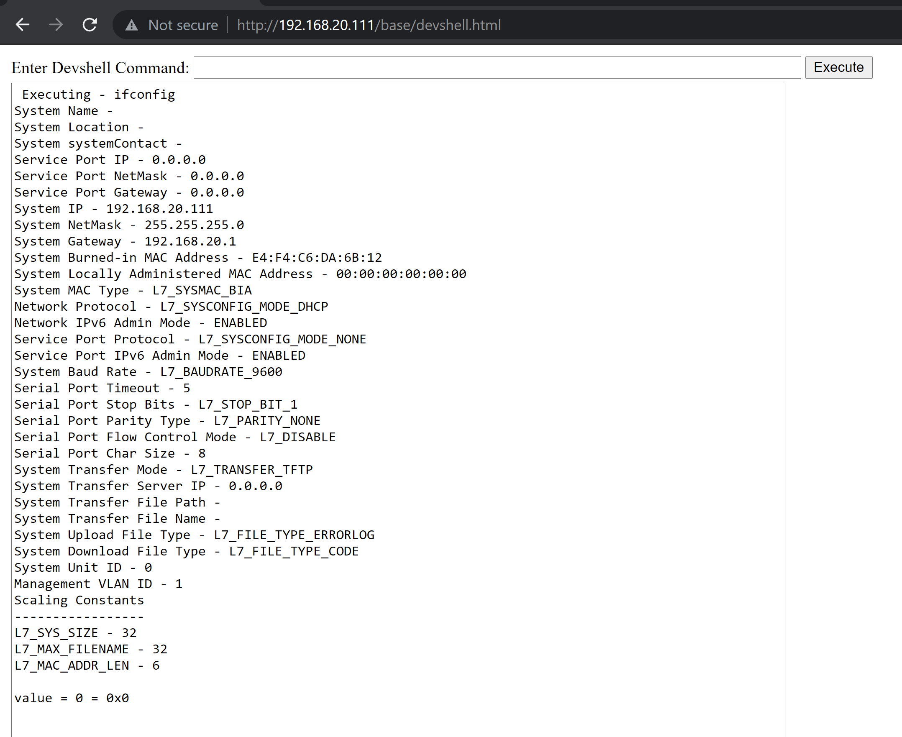

# Firmware Archeaology I: Netgear GS110TPv2

Published: June 7, 2021

This is the first in a series of blog posts that will explore older firmware images to examine different reverse engineering techniques.  The first post concerns the Netgear GS110TPv2 and GS108Tv2 which use the same firmware images.  This is a 10 port POE switch in the ProSafe family of products.

We will be looking at two versions primarily:

* `5.4.2.29`
* `5.4.2.30`

and then in the end `5.4.2.33` - which is the latest version as of this writing.

From the Release notes, located [here](https://kb.netgear.com/000038660/GS110TP-GS108Tv2-Firmware-Version-5-4-2-30)

>Fixed the issue where the debugging URL of ‘devshell’ is accessible without authentication.

So it looks like there was a debug html page available pre-auth in `5.4.2.29`, but certain questions remain:

1) Did they remove the `devshell` altogether?
2) Did they just place the `devshell` behind authentication?

Let's take a look at the binary and try to answer these questions by looking at the changes.

# Extraction

Let us run binwalk over the `stk` files provided in the zip:

```
$ binwalk GS108Tv2_GS110TP_v5.4.2.29.stk

DECIMAL       HEXADECIMAL     DESCRIPTION
--------------------------------------------------------------------------------
172           0xAC            7-zip archive data, version 0.2
3779611       0x39AC1B        CFE boot loader
4052515       0x3DD623        Copyright string: "Copyright (C) 2000,2001,2002,2003,2004,2005 Broadcom Corporation."
```

Let's carve out that 7-zip data:
```
$ dd if=GS108Tv2_GS110TP_v5.4.2.29.stk of=GGS108Tv2_GS110TP_v5.4.2.29.stk.7z bs=172 skip=1
$ 7z x GS108Tv2_GS110TP_v5.4.2.29.stk.7z
```
Now we should have a file named `switchdrvr.bin` - this is the raw firmware image:

```
$ file switchdrvr.bin
switchdrvr.bin: ELF 32-bit MSB executable, MIPS, MIPS32 version 1 (SYSV), statically linked, stripped
```
The image files are 16MB in size. The firmware images are 32-bit MIPS eCos images. These images include the entirety of the operating system in addition to all application code, so they take quite a while to analyze in Ghidra.

# Finding the devshell

My normal first step would be to run bindiff over the firmware images, but there is currently a bug in BinExport/Ghidra that prevents bindiffing of MIPS binaries (see [https://github.com/google/binexport/issues/76](https://github.com/google/binexport/issues/76) for more info).

Instead, we are going to search for the string `devshell` in Ghidra.

Looking at the `5.4.2.29` image, we can see the string `/base/devshell.html` in the strings menu.  When I go to that URL path in a browser, this is what I see:



The weird thing is I definitely have to be authenticated with a valid `SID` cookie in order to load the `/base/devshell.html`.  The POST request that executes a OS command also requires authentication.  So what exactly did the manufacturer change?

The string `Available Commands` is present in the HTTP POST response, so lets look for that in the binary.

In the `5.4.2.29` image I see one occurance of the string `Available Commands`, and it leads me to the function at address `0x803bdf68`.

```c++

void FUN_803bdf68(void)

{
  int iVar1;
  uint uVar2;
  uint uVar3;
  
  FUN_80301974("\nAvailable Commands:\n");
  uVar2 = 0;
  if (DAT_80edcc08 != 0) {
    do {
      iVar1 = FUN_803c570c((&PTR_s_cablediag_80edc960)[uVar2 * 2],&DAT_80abb9d0);
      uVar3 = uVar2 + 1;
      if (iVar1 != 1) {
        FUN_80301974("\t%p\t%s\n",(&PTR_LAB_80edc964)[uVar2 * 2],
                     (&PTR_s_cablediag_80edc960)[uVar2 * 2]);
      }
      uVar2 = uVar3;
    } while (uVar3 < DAT_80edcc08);
  }
  FUN_80301974("\nPlease see the source code for parameter lists.\n\n");
  return;
}
```

Bingo, this is the code responsible for printing out the `help` output.  Lets go up a node in the call graph and see where `FUN_803bdf68` is called:

```c++
undefined4 FUN_80364c14(char *param_1)

{
  code *pcVar1;
  int iVar2;
  char local_170 [256];
  undefined4 local_70;
  undefined4 local_6c;
  undefined4 local_68;
  undefined4 local_64;
  undefined4 local_48;
  undefined4 local_44;
  undefined4 local_40;
  undefined4 local_3c;
  undefined4 local_38;
  undefined4 local_34;
  undefined4 local_30;
  undefined4 local_2c;
  undefined4 local_28;
  undefined4 local_24;
  undefined4 local_20 [4];
  
  FUN_80364e98(param_1,local_170,&local_70);
  if (local_170[0] == '\0') {
    if (*param_1 != '\0') {
      FUN_80301974("\nParse error.\n");
    }
  }
  else {
    pcVar1 = (code *)FUN_803bddc8(local_170);
    if (pcVar1 == (code *)0x0) {
      iVar2 = FUN_803c570c(param_1,&DAT_80a45d04);
      if ((iVar2 == 1) || (iVar2 = FUN_803c570c(param_1,&DAT_80a45d0c), iVar2 == 1)) {
        FUN_803bdf68();
      }
      else {
        iVar2 = FUN_803bddc0(local_170,local_20,local_70,local_6c,local_48,local_44,local_40,
                             local_3c,local_38,local_34,local_30,local_2c,local_28,local_24);
        if (iVar2 == 0) {
          FUN_80301974("\nvalue = %d = 0x%x\n",local_20[0],local_20[0]);
        }
        else {
          FUN_80301974("Undefined symbol: %s\n",local_170);
          FUN_80301974("\n\tType \'help\' for assistance\n\n");
        }
      }
    }
    else {
      FUN_80301974("\n Executing - %s\n",local_170);
      local_20[0] = (*pcVar1)(local_70,local_6c,local_68,local_64,local_40,local_3c,local_38,
                              local_34,local_30,local_2c,local_28,local_24);
      FUN_80301974("\nvalue = %d = 0x%x\n",local_20[0],local_20[0]);
    }
  }
  return 0;
}
```

This function (located at address `0x80364c14`) seems to be the HTTP request handler for the execute command function in the devsehll.

# Fixed version

Now lets see if these functions have counter parts in the `5.4.2.30` firmware image.

Searching for the string `devshell` reveals the same strings in `5.4.2.30` - `/base/devshell.html`.

Searching for the string `Available Commands` reveals a string without a reference.  Maybe the `help` command was removed?

However, searching for the string `Undefined symbol`, which is present in the HTTP resquest handler function in `5.4.2.29` leads us to the corresponding function in `5.4.2.30`.

```c++

undefined4 FUN_80364f84(char *param_1)

{
  code *pcVar1;
  int iVar2;
  char local_170 [256];
  undefined4 local_70;
  undefined4 local_6c;
  undefined4 local_68;
  undefined4 local_64;
  undefined4 local_48;
  undefined4 local_44;
  undefined4 local_40;
  undefined4 local_3c;
  undefined4 local_38;
  undefined4 local_34;
  undefined4 local_30;
  undefined4 local_2c;
  undefined4 local_28;
  undefined4 local_24;
  undefined4 local_20 [4];
  
  FUN_803651f0(param_1,local_170,&local_70);
  if (local_170[0] == '\0') {
    if (*param_1 != '\0') {
      FUN_80301ce4("\nParse error.\n");
    }
  }
  else {
    pcVar1 = (code *)FUN_803be120(local_170);
    if (pcVar1 == (code *)0x0) {
      iVar2 = FUN_803c599c(param_1,&DAT_80a45fd4);
      if ((iVar2 != 1) && (iVar2 = FUN_803c599c(param_1,&DAT_80a45fdc), iVar2 != 1)) {
        iVar2 = FUN_803be118(local_170,local_20,local_70,local_6c,local_48,local_44,local_40,
                             local_3c,local_38,local_34,local_30,local_2c,local_28,local_24);
        if (iVar2 == 0) {
          FUN_80301ce4("\nvalue = %d = 0x%x\n",local_20[0],local_20[0]);
        }
        else {
          FUN_80301ce4("Undefined symbol: %s\n",local_170);
          FUN_80301ce4("\n\tType \'help\' for assistance\n\n");
        }
      }
    }
    else {
      FUN_80301ce4("\n Executing - %s\n",local_170);
      local_20[0] = (*pcVar1)(local_70,local_6c,local_68,local_64,local_40,local_3c,local_38,
                              local_34,local_30,local_2c,local_28,local_24);
      FUN_80301ce4("\nvalue = %d = 0x%x\n",local_20[0],local_20[0]);
    }
  }
  return 0;
}
```

Looking at the differences, this line is present in `5.4.2.29` but not `5.4.2.30`:

```c++
FUN_80301974("\n\tType \'help\' for assistance\n\n");
```

# Changes?

Looks like they _did_ remove the `help` command.  It does not look like they are filtering out any other commands though, so the `devshell` should still work if you know the commands.

For reference, here they are (output from `5.4.2.29` - the addresses will be different for other versions but you don't need the addresses to execute the commands)!

```
Available Commands:
	0x80077ddc	cablediag
	0x803beb74	cat
	0x803bc45c	changeMallocDebug
	0x80366788	cliInfoDump
	0x8029e508	cnfgrDump
	0x802f2ff4	configClear
	0x802e83a0	configDump
	0x802f301c	configSave
	0x803ba85c	crashPrint
	0x803ba884	flashLogPrint
	0x8005a758	debugPolicyGroup
	0x80054b7c	debugPolicyTable
	0x803cd864	debugTftp
	0x803be4d0	del
	0x8004d1dc	dev
	0x803be33c	dir
	0x802b6d34	driv
	0x803b7c08	dtlDebug
	0x803b8eb4	dtlEndStats
	0x803ba364	dtlMacToPortShow
	0x803b780c	dtlNetDebugSet
	0x8049dd40	dumpFdbStats
	0x803c7720	dumpMemory
	0x8045681c	dump_snmp_engine_id
	0x803c4048	ecos_net_stats
	0x8008af98	getBoardId
	0x80046cb8	hapiBroadDebugPkt
	0x80046cec	hapiBroadDebugPktFilterGet
	0x80046d1c	hapiBroadDebugPktFilterSet
	0x80074658	hapiBroadPolicyDebug
	0x802f64e0	if
	0x802f64e0	ifconfig
	0x802d4458	logClear
	0x802cfc38	logConsole
	0x803c7d10	logError
	0x802d4730	logShow
	0x80307334	mbufFree
	0x8030654c	mbufHistoryClear
	0x803064c4	mbufHistoryDelete
	0x803065c4	mbufHistoryDump
	0x803063a8	mbufHistoryInit
	0x80306710	mbufShow
	0x803bb874	memCheck
	0x803bd224	memShow
	0x8004e930	mmuConfig
	0x80051e38	mmuCount
	0x8005102c	mmuState
	0x803c790c	modMemory
	0x803c1c4c	msgQ
	0x803c203c	msgQprint
	0x803c1cf4	msgQshow
	0x802d8bd4	nimDebugDump
	0x802d9b9c	nimPortDump
	0x802e8044	nsdpDebugSet
	0x803bc060	osapiDebugMallocDetail
	0x803bbf7c	osapiDebugMallocDetailEnable
	0x803bb5b0	osapiDebugMallocSummary
	0x803bbe54	osapiDebugMemoryInfo
	0x803bbc24	osapiDebugMemoryStats
	0x803c1c4c	osapiDebugMsgQueuePrint
	0x803bb5b0	osapiMemShow
	0x803c1cf4	osapiMsgQueueShow
	0x803bb38c	osapiRedir
	0x803c75e8	osapiTaskShow
	0x8004d208	phyDump
	0x800be2cc	phyget
	0x800be6cc	physet
	0x802eb2a0	poeCfgDump
	0x80074658	policy
	0x80074138	policyTable
	0x8029b808	poolShow
	0x80046310	reboot
	0x8004e0c0	regDump
	0x803c4010	routePrint
	0x800498f0	rxShow
	0x802f2f28	setdhcp
	0x802870dc	shadowDump
	0x803c7cb4	showCS
	0x8023fc2c	soc_property_get
	0x8043c8a0	ssltDebugLevelSet
	0x80300edc	sysShow
	0x803bd33c	taskShow
	0x803bca1c	upTime
```

It looks like the only change made was to remove the `help` command handler function along with the help prompt output when an invalid command is supplied.  For example, on version `5.4.2.30` I get the following output when I submit `ifconfig`:



## Cool but what about the latest firmware version?

Now, neither version `5.4.2.29` or `5.4.2.30` is the latest version as of this writing.  Version `5.4.2.33` is the latest version.  Does this version match version `5.4.2.33` in that

* Does it have `/base/devshell.html`
* Does it have the `help` command handler function removed?
* Does it have the `help` command prompt output when an invalid command is specified?

The decompiler output for the `devshell` handler function for version `5.4.2.33`:

```c++
undefined4 FUN_80365b0c(char *param_1)

{
  code *pcVar1;
  int iVar2;
  char local_170 [256];
  undefined4 local_70;
  undefined4 local_6c;
  undefined4 local_68;
  undefined4 local_64;
  undefined4 local_48;
  undefined4 local_44;
  undefined4 local_40;
  undefined4 local_3c;
  undefined4 local_38;
  undefined4 local_34;
  undefined4 local_30;
  undefined4 local_2c;
  undefined4 local_28;
  undefined4 local_24;
  undefined4 local_20 [4];
  
  FUN_80365d78(param_1,local_170,&local_70);
  if (local_170[0] == '\0') {
    if (*param_1 != '\0') {
      FUN_8030286c("\nParse error.\n");
    }
  }
  else {
    pcVar1 = (code *)FUN_803bf9c8(local_170);
    if (pcVar1 == (code *)0x0) {
      iVar2 = FUN_803c7244(param_1,&DAT_80a47d7c);
      if ((iVar2 != 1) && (iVar2 = FUN_803c7244(param_1,&DAT_80a47d84), iVar2 != 1)) {
        iVar2 = FUN_803bf9c0(local_170,local_20,local_70,local_6c,local_48,local_44,local_40,
                             local_3c,local_38,local_34,local_30,local_2c,local_28,local_24);
        if (iVar2 == 0) {
          FUN_8030286c("\nvalue = %d = 0x%x\n",local_20[0],local_20[0]);
        }
        else {
          FUN_8030286c("Undefined symbol: %s\n",local_170);
          FUN_8030286c("\n\tType \'help\' for assistance\n\n");
        }
      }
    }
    else {
      FUN_8030286c("\n Executing - %s\n",local_170);
      local_20[0] = (*pcVar1)(local_70,local_6c,local_68,local_64,local_40,local_3c,local_38,
                              local_34,local_30,local_2c,local_28,local_24);
      FUN_8030286c("\nvalue = %d = 0x%x\n",local_20[0],local_20[0]);
    }
  }
  return 0;
}

```

Looks like the help prompt is back function is back! Is the handler function for the help command in this version too? Searching for the string `Available Commands` again does not return a referenced string, so it looks like the `help` function handler is not present.

Indeed, when I run `help` on version `5.4.2.33` I see this no help function output but also no error message indicating an invalid command.

Alas the devshell still works in the latest version:


## Conclusion

This exercise would have been much easier with bindiffing capabilities provided by tools like BinExport/BinDiff, but even without those tools it is possible to manually diff the functions if you know what you are looking for.  Using strings as guideposts, its possible to navigate the control flow of a program.

[Back](/)