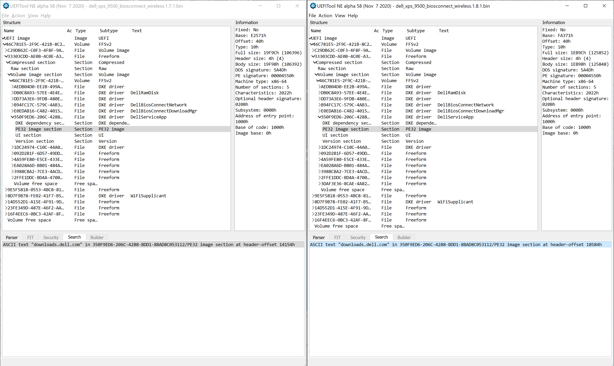
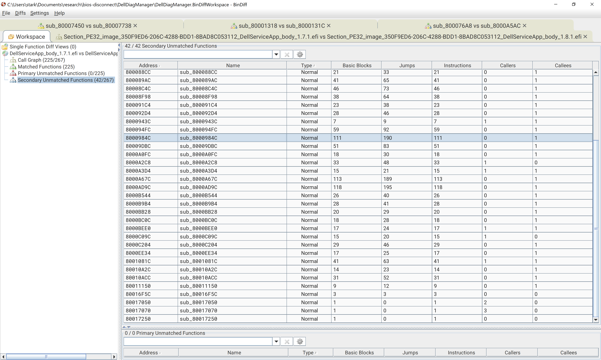
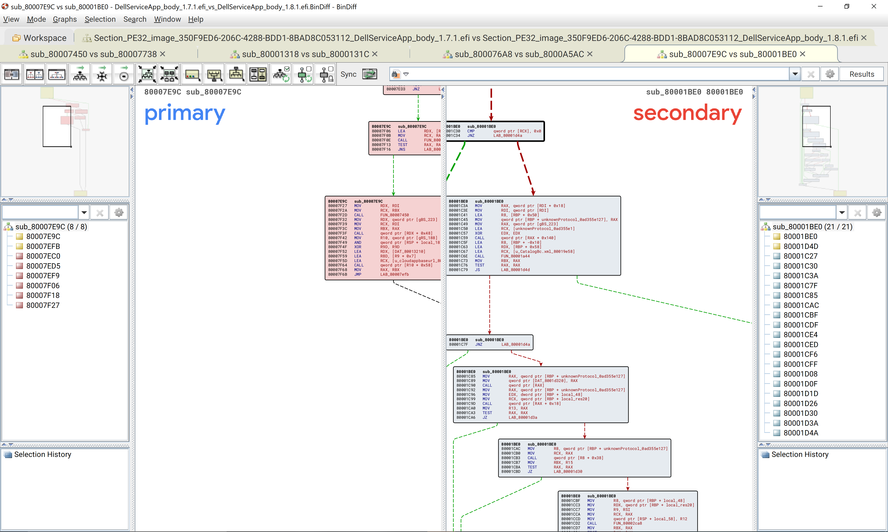

# "BIOS Disconnect" Vulnerability Diffing

Published: June 27, 2021

## Background

Recently Eclypsium announced the "BIOS Disconnect" vulnerabilities.  These are four previously unknown vulnerabilities in the `BIOSConnect` capability embedded in the UEFI implementation of newer Dell hosts.  Read more about it here:

[https://eclypsium.com/2021/06/24/biosdisconnect/](https://eclypsium.com/2021/06/24/biosdisconnect/)

and here:

[https://eclypsium.com/wp-content/uploads/2021/06/Eclypsium-Discovers-Multiple-Vulnerabilities-Affecting-129-Dell-Models-via-Dell-Remote-OS-Recovery-and-Firmware-Update-Capabilities.pdf](https://eclypsium.com/wp-content/uploads/2021/06/Eclypsium-Discovers-Multiple-Vulnerabilities-Affecting-129-Dell-Models-via-Dell-Remote-OS-Recovery-and-Firmware-Update-Capabilities.pdf)

**Note that I was not involved in any way in the discovery of these vulnerabilities and full credit is due to the researchers at Eclypsium**

The biggest flaw, and the flaw that enabled the other three vulnerabilities to be exploited, was the lack of hostname validation when retrieiving firmware metadata from vendor-controlled servers. Any valid TLS cert, albeit with a different hostname, would be excepted in vulnerable versions of the firmware.  

## Intent

The intent of this article is to examine the vendor provided fixes for the "BIOS Disconnect" vulnerabilities.  We will use a suite of tools to manipulate the firmware images, search them, and look at the differences.  This article only focuses on only one of the four discovered vulnerabilities.

On a Dell XPS 9500, the fixed firmware version was `1.8.1` and the last vulnerable version was `1.7.1`.

* `1.8.1` - [https://dl.dell.com/FOLDER07401752M/1/XPS_9500_1.8.1.exe](https://dl.dell.com/FOLDER07401752M/1/XPS_9500_1.8.1.exe)
* `1.7.1` - [https://dl.dell.com/FOLDER07196164M/1/XPS_9500_1.7.1.exe](https://dl.dell.com/FOLDER07196164M/1/XPS_9500_1.7.1.exe)

Note that these are windows-based executables for launching the UEFI updates downloaded directly from the vendor.  They contain the actual UEFI implementation binary images within themselves.  We will need to use a tool to extract the UEFI image from these `.exe` installer files.

## Extraction

We will use this script to extract the firmware images from the installers:

[https://github.com/platomav/BIOSUtilities/raw/master/Dell%20PFS%20BIOS%20Extractor/Dell_PFS_Extract.py](https://github.com/platomav/BIOSUtilities/raw/master/Dell%20PFS%20BIOS%20Extractor/Dell_PFS_Extract.py)

Grab that script and run it against each of the `.exe` files:

```
$ python3 Dell_PFS_Extract.py XPS_9500_1.7.1.exe
$ python3 Dell_PFS_Extract.py XPS_9500_1.8.1.exe
```

This will create two directories with various firmware-related binary images in it:

```
XPS_9500_1.8.1.exe_extracted 
XPS_9500_1.7.1.exe_extracted 
```

The contents of these directories will look like this:

```
$ ls XPS_9500_1.8.1.exe_extracted/
'1 -- 1 System BIOS with BiosGuard v1.8.1.bin'   '1 -- 15 BiosConnect Core FV v1.19.5.bin'                                     '1 -- 5 Integrated Sensor Hub PDT Data v0.0.0.2.bin'
'1 -- 10 Embedded Controller v1.0.7.bin'         '1 -- 16 BiosConnect Wireless FV v1.19.5.bin'                                 '1 -- 6 Main System Cypress Port Controller 0 v1.12.64.50.bin'
'1 -- 11 Backup Embedded Controller v1.0.5.bin'  '1 -- 17 Model Information v1.0.0.0.txt'                                      '1 -- 7 Main System Cypress Port Controller 1 v1.10.64.30.bin'
'1 -- 12 Cypress MCU FW v71.61.11.1.bin'         '1 -- 2 Intel Management Engine Corporate Firmware Update v14.1.53.1649.bin'  '1 -- 8 Embedded Controller v1.0.7.bin'
'1 -- 13 PCR0 XML v0.0.0.1.xml'                  '1 -- 3 Intel Management Engine Consumer Firmware Update v14.1.53.1649.bin'   '1 -- 9 Backup Embedded Controller v1.0.5.bin'

```

`'1 -- 1 System BIOS with BiosGuard v1.8.1.bin'` is the file I started with. I also tried `'1 -- 15 BiosConnect Core FV v1.19.5.bin'` and then `'1 -- 16 BiosConnect Wireless FV v1.19.5.bin'`.  The latter turned out to contain the code responsible for the vulnerability.

# Searching

Next we need to find the specific UEFI module that contains the code in question.  This is a difficult task because we don't know exactly what to look for.  Also, Ghidra does not have indexing capabilities for entire firmware images as far as I know.  The easiest way to search these binaries for strings is by using [UEFITool](https://github.com/LongSoft/UEFITool).

Open up UEFITool and load each firmware image into different UEFITool windows.  Then hit `CTRL+F` to search the UEFI image for strings. If there is a match, UEFITool will report the location of the string in terms of UEFI modules.  That way we can hone in on a few modules, searching by keywords, to begin our quest for finding the proper UEFI module that handles the functionality in question.

A few notes on searching: I usually try to search with Unicode enabled and disabled.  Sometimes strings in UEFI implementations are unicode; some times they are ASCII.  Searching for both will often yield results you wouldn't otherwise see. Also, I usually search with case sensitivity disabled, unless I really know what I am looking for.

The original PDF writeup mentions a few clues to help use narrow our search:

>The process of verifying the certificate for dell.com is done by first retrieving the DNS record from the hard-coded server 8.8.8.8 (Google) then establishing a connection to https://downloads.dell.com

We want to search for `https://downloads.dell.com` using UEFI Tool in the `'1 -- 16 BiosConnect Wireless FV v1.19.5.bin'` file. I also searched for `8.8.8.8`.



The results for these searches, which were the same for both firmware images, are listed below:

```
ASCII text "downloads.dell.com" in 350F9ED6-206C-4288-BDD1-8BAD8C053112/PE32 image section at header-offset 14154h
ASCII text "8.8.8.8" in B94FC17C-579C-4AB3-BA28-678D1813D1D6/PE32 image section at header-offset 16CB4h
ASCII text "8.8.8.8" in 350F9ED6-206C-4288-BDD1-8BAD8C053112/PE32 image section at header-offset 14314h
```

The strings `downloads.dell.com` and `8.8.8.8` appear in a DXE Driver named `DellServiceApp`. `8.8.8.8` also appears in another DXE Driver named `DellBiosConnectNetwork`. First lets look at `DellServiceApp`. I right click on the corresponding entry in the UEFITool mainview and select `Export Body` for each version. Next I load both PE32 files into Ghidra and perform the autoanalysis, including with `efiSeek` analysis enabled. By looking up the `downloads.dell.com` string address in Ghidra, I learn that the string exists in the function at address `0x80001318` (`1.7.1`) and `0x8000131c` (`1.8.1`).  This tells me I have the right DXE driver to reverse engineer.

## Finding the fix

Using Ghidra, I looked through the strings in the `DellServiceApp` for version `1.8.1` and ended up seeing this:

`"Failed to verify URL."`

This looks like a promising string to take a look at.  The whole function looks like this:

```c++
EFI_STATUS
verify_url(char *param_1,char *param_2,ulonglong param_3,longlong *param_4,byte **param_5,
          longlong *param_6)

{
  char **ppcVar1;
  ulonglong *puVar2;
  ulonglong uVar3;
  byte **ppbVar4;
  longlong *plVar5;
  int iVar6;
  char cVar7;
  EFI_STATUS EVar8;
  undefined8 uVar9;
  ulonglong uVar10;
  char *pcVar11;
  char *pcVar12;
  longlong lVar13;
  ulonglong uVar14;
  longlong *local_res20;
  undefined4 local_498;
  int local_494 [3];
  ulonglong local_488;
  ulonglong local_480;
  ulonglong local_478;
  INT64 *unknownProtocol_0ad355e121;
  INT64 *unknownProtocol_92fd000918;
  ulonglong local_458;
  ulonglong local_450;
  longlong local_448;
  undefined8 local_438;
  undefined8 local_338;
  char local_13a [258];
  
  local_338._0_1_ = 0;
  local_res20 = param_4;
  FUN_80016fd4((undefined *)((longlong)&local_338 + 1),0,0x2fc);
  local_438._0_1_ = 0;
  FUN_80016fd4((undefined *)((longlong)&local_438 + 1),0,0xfe);
  local_498 = 0;
  unknownProtocol_0ad355e121 = (INT64 *)0x0;
  unknownProtocol_92fd000918 = (INT64 *)0x0;
  local_494[0] = 0;
  FUN_80017070((undefined *)&local_338,0x2fd,0);
  FUN_80017070((undefined *)&local_438,0xff,0);
  EVar8 = (*gBS_223->LocateProtocol)
                    (&unknownProtocol_0ad355e1,(void *)0x0,&unknownProtocol_0ad355e121);
  if ((longlong)EVar8 < 0) {
    return EVar8;
  }
  if (unknownProtocol_0ad355e121 == (INT64 *)0x0) {
    return EVar8;
  }
  EVar8 = FUN_8000943c((longlong)unknownProtocol_0ad355e121,param_2,(int)param_3,local_494);
  iVar6 = local_494[0];
  plVar5 = param_6;
  ppbVar4 = param_5;
  if ((longlong)EVar8 < 0) {
    return 0x800000000000000e;
  }
  cVar7 = '\x02';
LAB_8000aea8:
  do {
    if (cVar7 == '\x02') {
      EVar8 = (*gBS_223->LocateProtocol)
                        (&unknownProtocol_92fd0009,(void *)0x0,&unknownProtocol_92fd000918);
      if ((longlong)EVar8 < 0) {
        return EVar8;
      }
      if (unknownProtocol_92fd000918 == (INT64 *)0x0) {
        return EVar8;
      }
      EVar8 = FUN_8000a0fc((longlong)unknownProtocol_0ad355e121,
                           (undefined **)unknownProtocol_92fd000918,param_2,param_3,ppbVar4);
      if ((longlong)EVar8 < 0) {
        if (iVar6 == 2) {
          (**(code **)(*plVar5 + 0x40))(4,s_Failed_to_verify_URL._80019e78,&local_498);
          if (*param_4 != 0) {
            FUN_800086bc(&local_res20,(longlong **)&param_5);
            return EVar8;
          }
          return EVar8;
        }
      }
      else {
        if (iVar6 == 2) {
          (**(code **)(*plVar5 + 0x50))();
        }
      }
      if (iVar6 == 1) {
        return EVar8;
      }
      if (iVar6 == 2) {
        cVar7 = '\x03';
      }
    }
    else {
      if (cVar7 == '\x03') {
        if (ppbVar4[8] != (byte *)0x0) {
          (**(code **)(*plVar5 + 0x50))(s_Checking_cloud_SOS_Schema_versio_8001ada0);
          puVar2 = (ulonglong *)ppbVar4[8];
          local_488 = *puVar2;
          local_480 = puVar2[1];
          local_478 = puVar2[2];
          if ((local_488 != 0) && (((1 < local_488 || (local_480 != 0)) || (local_478 != 0)))) {
            uVar10 = 0;
            uVar14 = uVar10;
            if (puVar2[6] != 0) break;
            goto LAB_8000b4c8;
          }
          (**(code **)(*plVar5 + 0x50))();
        }
        cVar7 = '\x04';
        goto LAB_8000aea8;
      }
      if (cVar7 == '\x04') {
        if ((param_4[2] != 0) && (pcVar11 = (char *)param_4[2], pcVar11 != (char *)0x0)) {
          lVar13 = 0;
          cVar7 = *pcVar11;
          while (pcVar12 = pcVar11, cVar7 != '\0') {
            lVar13 = lVar13 + 1;
            cVar7 = pcVar11[lVar13];
          }
          while (((char *)(lVar13 + 1) != (char *)0x0 &&
                 (pcVar12 = FUN_80017050(pcVar12,(char *)(lVar13 + 1),'/'), pcVar12 != (char *)0x0))
                ) {
            pcVar11[(int)pcVar12 - (int)pcVar11] = '\\';
            pcVar12 = pcVar12 + 1;
            lVar13 = 0;
            cVar7 = *pcVar12;
            while (cVar7 != '\0') {
              lVar13 = lVar13 + 1;
              cVar7 = pcVar12[lVar13];
            }
          }
        }
        cVar7 = '\x06';
        goto LAB_8000aea8;
      }
      if (cVar7 == '\x06') {
        ppcVar1 = (char **)ppbVar4[7];
        uVar9 = FUN_80010a2c(*ppcVar1);
        uVar14 = 0;
        if ((char)uVar9 == '\0') {
          (**(code **)(*plVar5 + 0x40))(4,s_Invalid_file_content_8001ae50,&local_498);
          if (*(void **)ppbVar4[7] != (void *)0x0) {
            (*gBS_223->FreePool)(*(void **)ppbVar4[7]);
          }
          if (*(void **)(ppbVar4[7] + 0x10) != (void *)0x0) {
            (*gBS_223->FreePool)(*(void **)(ppbVar4[7] + 0x10));
          }
          if (*(void **)(ppbVar4[7] + 0x18) != (void *)0x0) {
            (*gBS_223->FreePool)(*(void **)(ppbVar4[7] + 0x18));
          }
        }
        else {
          FUN_800081e0(ppcVar1[2]);
          pcVar11 = *(char **)((longlong)ppbVar4[7] + 0x10);
          uVar10 = uVar14;
          if (pcVar11 != (char *)0x0) {
            do {
              if (pcVar11[uVar10] == '\0') break;
              uVar10 = uVar10 + 1;
            } while (uVar10 < 0x400);
            if (1 < uVar10) {
              do {
                if (pcVar11[uVar14] == '\0') break;
                uVar14 = uVar14 + 1;
              } while (uVar14 < 0x400);
              if ((pcVar11[uVar14 - 1] != '/') && (*pcVar11 != '.')) {
                if (param_1 == (char *)0x0) {
                  EVar8 = 0x8000000000000002;
                }
                else {
                  EVar8 = FUN_80008f98(param_1,*(char **)ppbVar4[7],&local_438);
                }
                if ((longlong)EVar8 < 0) {
                  return EVar8;
                }
                EVar8 = FUN_80010acc(&local_438,&local_338);
                if ((longlong)EVar8 < 0) {
                  return EVar8;
                }
                pcVar12 = s_cacert.pem_8001ae68;
                pcVar11 = local_13a;
                cVar7 = local_13a[0];
                while ((cVar7 != '\0' && (cVar7 == *pcVar12))) {
                  pcVar11 = pcVar11 + 1;
                  pcVar12 = pcVar12 + 1;
                  cVar7 = *pcVar11;
                }
                if (*pcVar11 == *pcVar12) {
                  (**(code **)(*plVar5 + 0x50))(s_Verifying_file_signature_8001ab08);
                  uVar14 = FUN_8001081c((longlong)unknownProtocol_92fd000918,
                                        *(char **)(ppbVar4[7] + 0x10),
                                        *(longlong *)(ppbVar4[7] + 0x18));
                  if ((longlong)uVar14 < 0) {
                    (**(code **)(*plVar5 + 0x40))(4,s_Failed_to_verify_file._8001ae78,&local_498);
                    return uVar14;
                  }
                  (**(code **)(*plVar5 + 0x50))(s_File_signature_verified_8001ab28);
                  DAT_8001d30b = 1;
                  EVar8 = FUN_80008238(plVar5[6],*(char **)(ppbVar4[7] + 0x10),
                                       *(longlong *)(ppbVar4[7] + 0x18));
                  if ((longlong)EVar8 < 0) {
                    (**(code **)(*plVar5 + 0x40))(4,s_Failed_to_verify_file._8001ae78,&local_498);
                    return EVar8;
                  }
                }
                FUN_80017070((undefined *)&local_438,0xff,0);
                FUN_80017070((undefined *)&local_338,0x2fd,0);
                cVar7 = '\a';
                goto LAB_8000aea8;
              }
            }
          }
          (**(code **)(*plVar5 + 0x40))(4,s_Invalid_file_content_8001ae50,&local_498);
          if (*(void **)ppbVar4[7] != (void *)0x0) {
            (*gBS_223->FreePool)(*(void **)ppbVar4[7]);
          }
          if (*(void **)(ppbVar4[7] + 0x10) != (void *)0x0) {
            (*gBS_223->FreePool)(*(void **)(ppbVar4[7] + 0x10));
          }
          if (*(void **)(ppbVar4[7] + 0x18) != (void *)0x0) {
            (*gBS_223->FreePool)(*(void **)(ppbVar4[7] + 0x18));
          }
        }
        ppbVar4[7] = (byte *)0x0;
        return 0x8000000000000002;
      }
      if (cVar7 == '\a') {
        uVar14 = 0;
        if (param_4[3] == 0) {
          return EVar8;
        }
        lVar13 = 0;
        goto LAB_8000aedf;
      }
    }
    if (cVar7 == '\t') {
      return EVar8;
    }
  } while( true );
LAB_8000b440:
  uVar3 = puVar2[7];
  local_458 = *(ulonglong *)(uVar3 + uVar10);
  local_450 = *(ulonglong *)(uVar3 + 8 + uVar10);
  local_448 = *(longlong *)(uVar3 + 0x10 + uVar10);
  if (((local_458 != 0) && (local_458 < 2)) && ((local_450 == 0 && (local_448 == 0)))) {
    (**(code **)(*plVar5 + 0x50))(s_Downloading_compatible_cloud_SOS_8001ae00);
    lVar13 = uVar14 * 0x118 + 0x18 + *(longlong *)(ppbVar4[8] + 0x38);
LAB_8000b511:
    uVar14 = maybe_download(plVar5,lVar13);
    return uVar14;
  }
  local_488 = *(ulonglong *)(uVar3 + uVar10);
  local_478 = *(ulonglong *)(uVar3 + 0x10 + uVar10);
  local_480 = local_450;
  if (((local_488 > DAT_8001d378 || DAT_8001d378 == local_488) && (local_488 <= DAT_8001d378)) &&
     ((local_450 > DAT_8001d380 || DAT_8001d380 == local_450 &&
      (((local_450 <= DAT_8001d380 && (local_478 > DAT_8001d388 || DAT_8001d388 == local_478)) &&
       (local_478 <= DAT_8001d388)))))) {
    (**(code **)(*plVar5 + 0x50))(s_Downloading_compatible_cloud_SOS_8001ae00);
    lVar13 = uVar14 * 0x118 + 0x18 + *(longlong *)(ppbVar4[8] + 0x38);
    goto LAB_8000b511;
  }
  uVar14 = uVar14 + 1;
  uVar10 = uVar10 + 0x118;
  if (puVar2[6] <= uVar14) {
LAB_8000b4c8:
    (**(code **)(*plVar5 + 0x40))(4,s_Compatible_cloud_SOS_not_found_8001ae30,&local_498);
    return 0x8000000000000002;
  }
  goto LAB_8000b440;
LAB_8000aedf:
  uVar9 = FUN_80010a2c(*(char **)(lVar13 + *param_4));
  if ((char)uVar9 == '\0') {
    (**(code **)(*plVar5 + 0x40))(4,s_Invalid_file_content_8001ae50,&local_498);
    FUN_800086bc(&local_res20,(longlong **)&param_5);
    EVar8 = 0x8000000000000002;
    param_4 = local_res20;
  }
  FUN_800081e0(*(char **)(lVar13 + 0x10 + *param_4));
  pcVar11 = *(char **)(lVar13 + 0x10 + *param_4);
  if (pcVar11 == (char *)0x0) {
LAB_8000b2cb:
    (**(code **)(*plVar5 + 0x40))(4,s_Invalid_file_content_8001ae50,&local_498);
    FUN_800086bc(&local_res20,(longlong **)&param_5);
    EVar8 = 0x8000000000000002;
    param_4 = local_res20;
  }
  else {
    uVar10 = 0;
    do {
      if (pcVar11[uVar10] == '\0') break;
      uVar10 = uVar10 + 1;
    } while (uVar10 < 0x400);
    if (uVar10 < 2) goto LAB_8000b2cb;
    uVar10 = 0;
    do {
      if (pcVar11[uVar10] == '\0') break;
      uVar10 = uVar10 + 1;
    } while (uVar10 < 0x400);
    if ((pcVar11[uVar10 - 1] == '/') || (*pcVar11 == '.')) goto LAB_8000b2cb;
  }
  if ((longlong)EVar8 < 0) {
    return EVar8;
  }
  uVar14 = uVar14 + 1;
  lVar13 = lVar13 + 0x28;
  if ((ulonglong)param_4[3] <= uVar14) {
    return EVar8;
  }
  goto LAB_8000aedf;
}
```

This function exists at `0x8000AD9C` in `1.8.1`.

This looks like a function that validates URLs.  A few more interesting details about this function include it seems to have a file signing check implemented, so perhaps the vendor added something like an HMAC to the metadata file for verification. It also looks like this function references the CA-cert bundle for hostname verification.

The big test is though if this function exists within the `1.7.1` image.  If no corresponding code is found in `1.7.1` then the aforementioned function is more likely to be part of the fix. Using [bindiff](https://www.zynamics.com/bindiff.html), we see that the function at this address is unmatched in version `1.7.1`.



I am confident the new function represents the bulk of the verification that fixes this vulnerability.  The new function is called through an intermediary function from the function at `0x80007e9c` (`1.7.1`) and `0x80001be0` (`1.8.1`).  This function exists in both images and changes significantly from `1.7.1` to `1.8.1`.



[Back](/)

